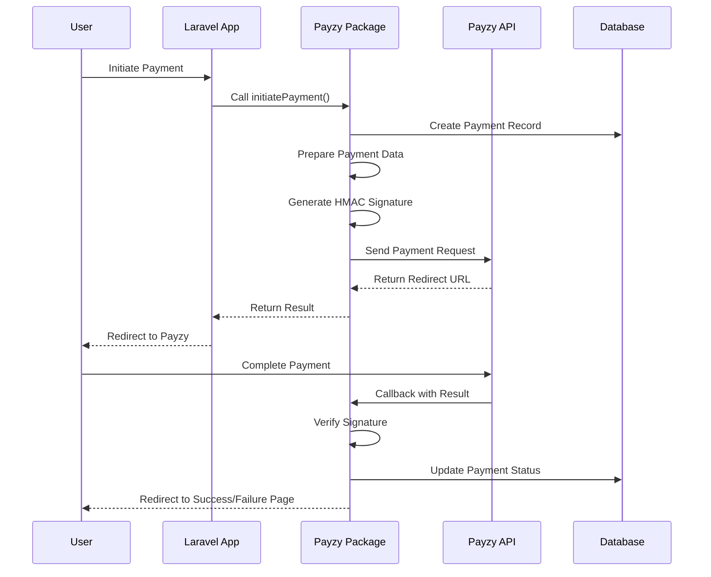

# Payzy Laravel Payment Gateway

A comprehensive Laravel package for integrating Payzy Payment Gateway into your Laravel applications. This package provides a clean, easy-to-use interface for processing payments through Payzy with full support for webhooks, callbacks, and payment verification.

[](https://packagist.org/packages/payzy-laravel/payment-gateway)
[](https://github.com/payzy-laravel/payment-gateway/actions?query=workflow%3Arun-tests+branch%3Amain)
[](https://github.com/payzy-laravel/payment-gateway/actions?query=workflow%3A"Check+%26+fix+styling"+branch%3Amain)
[](https://packagist.org/packages/payzy-laravel/payment-gateway)

## Table of Contents

- [Features](#features)
- [Requirements](#requirements)
- [Installation](#installation)
- [Configuration](#configuration)
- [Environment Variables](#environment-variables)
- [Usage](#usage)
- [Architecture](#architecture)
- [Implementation Workflow](#implementation-workflow)
- [API Reference](#api-reference)
- [Events](#events)
- [Testing](#testing)
- [Troubleshooting](#troubleshooting)
- [Contributing](#contributing)
- [Security](#security)
- [License](#license)

## Features

- ✅ **Complete Payzy Integration** - Full support for Payzy payment processing
- ✅ **Signature Verification** - Secure HMAC-SHA256 signature verification
- ✅ **Payment Tracking** - Comprehensive payment status tracking and logging
- ✅ **Webhook Support** - Handle payment callbacks and webhooks
- ✅ **Laravel Integration** - Native Laravel service provider and facade
- ✅ **Database Migrations** - Ready-to-use database tables for payments
- ✅ **Event System** - Laravel events for payment lifecycle management
- ✅ **Test Mode Support** - Easy testing with Payzy's test environment
- ✅ **Payment Items** - Support for itemized payments and order tracking
- ✅ **Configurable** - Extensive configuration options for customization
- ✅ **PSR-4 Compliant** - Follows PHP-FIG standards
- ✅ **Fully Tested** - Comprehensive test suite included

## Requirements

- PHP 8.1 or higher
- Laravel 10.0 or higher
- MySQL 8.0 or higher (for JSON column support)
- Guzzle HTTP Client 7.0 or higher
- Valid Payzy merchant account

## Installation

You can install the package via Composer:

```bash
composer require payzy-laravel/payment-gateway
```

### Publish Configuration

Publish the configuration file:

```bash
php artisan vendor:publish --tag="payzy-config"
```

### Publish Migrations

Publish and run the migrations:

```bash
php artisan vendor:publish --tag="payzy-migrations"
php artisan migrate
```

### Service Provider (Auto-Discovery)

If you're using Laravel 5.5+, the service provider will be automatically discovered. For older versions, add the service provider to your `config/app.php`:

```php
'providers' => [
    // Other Service Providers
    PayzyLaravel\PaymentGateway\Providers\PayzyServiceProvider::class,
],
```

### Facade (Optional)

Add the facade to your `config/app.php`:

```php
'aliases' => [
    // Other Facades
    'Payzy' => PayzyLaravel\PaymentGateway\Facades\Payzy::class,
],
```

## Configuration

The package configuration file will be published to `config/payzy.php`. Here are the key configuration options:

### Basic Configuration

```php
<?php

return [
    // Test mode (true for testing, false for production)
    'test_mode' => env('PAYZY_TEST_MODE', true),
    
    // Payzy credentials
    'shop_id' => env('PAYZY_SHOP_ID', ''),
    'secret_key' => env('PAYZY_SECRET_KEY', ''),
    
    // API endpoints
    'api_url' => env('PAYZY_API_URL', 'https://api.payzy.lk/checkout/custom-checkout'),
    'response_url' => env('PAYZY_RESPONSE_URL', ''),
    
    // Platform settings
    'platform' => env('PAYZY_PLATFORM', 'custom'),
    'version' => env('PAYZY_VERSION', '1.0'),
    
    // Default currency
    'default_currency' => env('PAYZY_DEFAULT_CURRENCY', 'LKR'),
];
```

### Advanced Configuration

The configuration file includes many more options for customization:

- **Database Configuration**: Custom table names and model relationships
- **Logging Configuration**: Custom logging channels and levels
- **Webhook Configuration**: Webhook endpoints and security settings
- **Event Configuration**: Enable/disable specific events
- **Validation Rules**: Custom validation for payment amounts and currencies
- **Route Configuration**: Custom route prefixes and middleware
- **Security Settings**: SSL verification and IP whitelisting

## Environment Variables

Add these environment variables to your `.env` file:

```env
# Payzy Configuration
PAYZY_TEST_MODE=true
PAYZY_SHOP_ID=your_shop_id_here
PAYZY_SECRET_KEY=your_secret_key_here
PAYZY_API_URL=https://api.payzy.lk/checkout/custom-checkout
PAYZY_RESPONSE_URL=https://your-domain.com/payzy/callback

# Optional Configuration
PAYZY_PLATFORM=custom
PAYZY_VERSION=1.0
PAYZY_DEFAULT_CURRENCY=LKR

# Logging (Optional)
PAYZY_LOGGING_ENABLED=true
PAYZY_LOG_CHANNEL=daily
PAYZY_LOG_LEVEL=info

# Webhook (Optional)
PAYZY_WEBHOOK_ENABLED=false
PAYZY_WEBHOOK_URL=https://your-domain.com/payzy/webhook
PAYZY_WEBHOOK_SECRET=your_webhook_secret

# Route Configuration (Optional)
PAYZY_ROUTE_PREFIX=payzy
PAYZY_ROUTE_MIDDLEWARE=web,auth

# User Model (Optional)
PAYZY_USER_MODEL=App\Models\User
PAYZY_PRODUCT_MODEL=App\Models\Product
```

### Environment Setup Guide

#### 1. Obtain Payzy Credentials

1. Sign up for a Payzy merchant account at [https://payzy.lk](https://payzy.lk)
2. Complete the merchant verification process
3. Obtain your Shop ID and Secret Key from the merchant dashboard
4. Configure your response URL in the Payzy dashboard

#### 2. Configure Response URL

Your response URL should point to the callback endpoint provided by this package:

```bash
https://your-domain.com/payzy/callback
```

Make sure this URL is accessible and properly configured in your Payzy merchant dashboard.

#### 3. Test vs Production

For testing:
```env
PAYZY_TEST_MODE=true
PAYZY_API_URL=https://api.payzy.lk/checkout/custom-checkout
```

For production:
```env
PAYZY_TEST_MODE=false
PAYZY_API_URL=https://api.payzy.lk/checkout/custom-checkout
```

## Usage

### Basic Payment Processing

```php
use PayzyLaravel\PaymentGateway\Services\PayzyPaymentService;

class CheckoutController extends Controller
{
    protected $payzyService;
    
    public function __construct(PayzyPaymentService $payzyService)
    {
        $this->payzyService = $payzyService;
    }
    
    public function processPayment(Request $request)
    {
        $orderData = [
            'order_id' => 'ORDER_' . time(),
            'amount' => 1000.00, // Amount in LKR
            'currency' => 'LKR',
            'user_id' => auth()->id(),
            'first_name' => 'John',
            'last_name' => 'Doe',
            'email' => 'john@example.com',
            'phone' => '+94771234567',
            'address' => '123 Main Street',
            'city' => 'Colombo',
            'state' => 'Western',
            'country' => 'Sri Lanka',
            'zip' => '10100',
        ];
        
        $result = $this->payzyService->initiatePayment($orderData);
        
        if ($result['success']) {
            return redirect($result['redirect_url']);
        } else {
            return back()->withErrors(['payment' => $result['message']]);
        }
    }
}
```

### Using the Facade

```php
use PayzyLaravel\PaymentGateway\Facades\Payzy;

// Initiate payment
$result = Payzy::initiatePayment($orderData);

// Verify payment
$verification = Payzy::verifyPayment($orderId, $responseCode, $signature);

// Prepare payment data
$paymentData = Payzy::preparePaymentData($orderData);
```

### Handling Payment Callbacks

The package automatically handles Payzy callbacks through the configured route. However, you can also handle them manually:

```php
use PayzyLaravel\PaymentGateway\Services\PayzyPaymentService;

class PaymentCallbackController extends Controller
{
    public function handleCallback(Request $request, PayzyPaymentService $payzyService)
    {
        $orderId = $request->query('x_order_id');
        $responseCode = $request->query('response_code');
        $signature = $request->query('signature');
        
        $result = $payzyService->verifyPayment($orderId, $responseCode, $signature);
        
        if ($result['success']) {
            // Payment successful
            return redirect()->route('payment.success');
        } else {
            // Payment failed
            return redirect()->route('payment.failed');
        }
    }
}
```

### Working with Payment Models

```php
use PayzyLaravel\PaymentGateway\Models\PayzyPayment;

// Find a payment
$payment = PayzyPayment::find(1);

// Check payment status
if ($payment->isCompleted()) {
    // Payment is completed
}

// Get user payments
$userPayments = PayzyPayment::byUser(auth()->id())->get();

// Get pending payments
$pendingPayments = PayzyPayment::pending()->get();

// Mark payment as failed
$payment->markAsFailed('Insufficient funds');
```

### Adding Payment Items

```php
use PayzyLaravel\PaymentGateway\Models\PayzyPayment;
use PayzyLaravel\PaymentGateway\Models\PayzyPaymentItem;

$payment = PayzyPayment::find(1);

// Add payment items
$payment->paymentItems()->create([
    'product_id' => 1,
    'product_name' => 'T-Shirt',
    'product_sku' => 'TSH-001',
    'quantity' => 2,
    'unit_price' => 500.00,
    'total_price' => 1000.00,
]);
```

## Architecture

### Package Structure

```bash
payzy-laravel-payment-gateway/
├── src/
│   ├── Controllers/
│   │   └── PayzyPaymentController.php
│   ├── Services/
│   │   └── PayzyPaymentService.php
│   ├── Models/
│   │   ├── PayzyPayment.php
│   │   └── PayzyPaymentItem.php
│   ├── Providers/
│   │   └── PayzyServiceProvider.php
│   └── Facades/
│       └── Payzy.php
├── config/
│   └── payzy.php
├── database/
│   └── migrations/
│       ├── create_payzy_payments_table.php
│       └── create_payzy_payment_items_table.php
├── routes/
│   └── payzy.php
├── tests/
├── composer.json
└── README.md
```

### Core Components

#### 1. PayzyPaymentService

The main service class that handles:

- Payment data preparation
- HMAC signature generation and verification
- API communication with Payzy
- Payment verification and validation

#### 2. PayzyPayment Model

Eloquent model for storing payment information:

- Payment status tracking
- JSON storage for payment and response data
- Relationships with users and payment items
- Helper methods for status checking

#### 3. PayzyPaymentController

HTTP controller providing REST API endpoints:

- Payment processing
- Status checking
- Callback handling
- Webhook processing

#### 4. Service Provider

Laravel service provider that:

- Registers services and facades
- Publishes configuration and migrations
- Loads routes and views
- Configures package settings

### Database Schema

#### payzy_payments table

| Column | Type | Description |
|--------|------|-------------|
| id | bigint(20) | Primary key |
| order_id | varchar(255) | Reference to your order system |
| user_id | bigint(20) | Reference to user (nullable) |
| payment_method | varchar(50) | Payment method (default: 'payzy') |
| transaction_id | varchar(100) | Unique transaction ID |
| amount | decimal(10,2) | Payment amount |
| currency | varchar(3) | Currency code (default: 'LKR') |
| payment_status | enum | Payment status (Pending, Completed, Failed, Cancelled) |
| payment_data | json | Payzy request data |
| response_data | json | Payzy response data |
| shipment_charges | decimal(10,2) | Shipping charges |
| paid_at | timestamp | Payment completion timestamp |
| created_at | timestamp | Creation timestamp |
| updated_at | timestamp | Update timestamp |

#### payzy_payment_items table

| Column | Type | Description |
|--------|------|-------------|
| id | bigint(20) | Primary key |
| payment_id | bigint(20) | Foreign key to payzy_payments |
| product_id | bigint(20) | Reference to your product system |
| product_name | varchar(255) | Product name |
| product_sku | varchar(255) | Product SKU |
| quantity | int(11) | Quantity ordered |
| unit_price | decimal(10,2) | Unit price |
| offer_price | decimal(10,2) | Offer price (nullable) |
| total_price | decimal(10,2) | Total price |
| product_data | json | Additional product information |
| created_at | timestamp | Creation timestamp |
| updated_at | timestamp | Update timestamp |

## Implementation Workflow

### Payment Processing Flow



### Implementation Steps

#### Step 1: Install and Configure

1. Install the package via Composer
2. Publish configuration and migrations
3. Configure environment variables
4. Run migrations

#### Step 2: Basic Integration

1. Create a checkout controller
2. Implement payment processing
3. Handle payment callbacks
4. Set up success/failure pages

#### Step 3: Advanced Features

1. Implement payment status checking
2. Add payment item tracking
3. Set up event listeners
4. Configure webhooks

#### Step 4: Testing and Deployment

1. Test with Payzy test mode
2. Verify callback handling
3. Test payment verification
4. Deploy to production

### Security Considerations

#### HMAC Signature Verification

The package implements secure HMAC-SHA256 signature verification:

```php
// Signature generation
$signatureString = $this->getSignatureString($data);
$hash = hash_hmac('sha256', $signatureString, $secretKey, true);
$signature = base64_encode($hash);

// Signature verification
$calculatedSignature = $this->generateSignature($verificationData);
$isValid = ($calculatedSignature === $receivedSignature);
```

#### Field Order Importance

Payzy requires exact field ordering for signature generation. The package handles this automatically:

```php
$signedFields = 'x_test_mode,x_shopid,x_amount,x_order_id,x_response_url,x_first_name,x_last_name,...';
```

#### SSL/TLS Requirements

- All API communication uses HTTPS
- Certificate verification is enabled by default
- Configurable SSL verification for testing

## API Reference

### PayzyPaymentService Methods

#### `initiatePayment(array $orderData, PayzyPayment $payment = null): array`

Initiates a payment with Payzy.

**Parameters:**

- `$orderData` (array): Payment and customer information
- `$payment` (PayzyPayment, optional): Existing payment record

**Returns:** Array with success status, redirect URL, and transaction details

**Example:**

```php
$result = $payzyService->initiatePayment([
    'order_id' => 'ORDER_123',
    'amount' => 1000.00,
    'first_name' => 'John',
    'last_name' => 'Doe',
    'email' => 'john@example.com',
    // ... other required fields
]);
```

#### `verifyPayment(string $orderId, string $responseCode, string $signature): array`

Verifies a payment callback from Payzy.

**Parameters:**

- `$orderId` (string): Order/Payment ID
- `$responseCode` (string): Payzy response code
- `$signature` (string): HMAC signature from Payzy

**Returns:** Array with verification status and payment details

#### `preparePaymentData(array $orderData): array`

Prepares payment data for Payzy API request.

**Parameters:**

- `$orderData` (array): Order and customer information

**Returns:** Array with formatted payment data and signature

### Controller Endpoints

The package provides these REST API endpoints:

#### `POST /payzy/process`

Process a new payment.

**Request Body:**

```json
{
    "order_id": "ORDER_123",
    "amount": 1000.00,
    "currency": "LKR",
    "first_name": "John",
    "last_name": "Doe",
    "email": "john@example.com",
    "phone": "+94771234567",
    "address": "123 Main Street",
    "city": "Colombo",
    "state": "Western",
    "country": "Sri Lanka",
    "zip": "10100"
}
```

**Response:**

```json
{
    "success": true,
    "message": "Payment initiated successfully",
    "redirect_url": "https://payzy.lk/checkout/...",
    "transaction_id": "payzy_abc123_1234567890",
    "payment_id": 1
}
```

#### `GET /payzy/callback`

Handle payment callback from Payzy.

**Query Parameters:**

- `x_order_id`: Order ID
- `response_code`: Payment result code
- `signature`: HMAC signature

#### `GET /payzy/payment/{paymentId}/status`

Get payment status.

**Response:**

```json
{
    "success": true,
    "payment": {
        "id": 1,
        "order_id": "ORDER_123",
        "transaction_id": "payzy_abc123_1234567890",
        "amount": 1000.00,
        "currency": "LKR",
        "payment_status": "Completed",
        "paid_at": "2024-01-01T12:00:00Z"
    }
}
```

### Model Methods

#### PayzyPayment Methods

```php
// Status checking
$payment->isPending();
$payment->isCompleted();
$payment->isFailed();
$payment->isCancelled();

// Status updates
$payment->markAsCompleted();
$payment->markAsFailed($reason);

// Relationships
$payment->user();
$payment->paymentItems();

// Scopes
PayzyPayment::pending();
PayzyPayment::completed();
PayzyPayment::failed();
PayzyPayment::byUser($userId);
```

## Events

The package fires Laravel events for payment lifecycle management:

### Available Events

#### PaymentInitiated

Fired when a payment is initiated.

```php
use PayzyLaravel\PaymentGateway\Events\PaymentInitiated;

// Listen for the event
Event::listen(PaymentInitiated::class, function ($event) {
    $payment = $event->payment;
    // Handle payment initiation
});
```

#### PaymentVerified

Fired when a payment is successfully verified.

```php
use PayzyLaravel\PaymentGateway\Events\PaymentVerified;

Event::listen(PaymentVerified::class, function ($event) {
    $payment = $event->payment;
    // Handle successful payment
    // Send confirmation email, update order status, etc.
});
```

#### PaymentFailed

Fired when a payment verification fails.

```php
use PayzyLaravel\PaymentGateway\Events\PaymentFailed;

Event::listen(PaymentFailed::class, function ($event) {
    $payment = $event->payment;
    $reason = $event->reason;
    // Handle failed payment
    // Log failure, notify admin, etc.
});
```

### Event Configuration

Enable/disable events in the configuration:

```php
'events' => [
    'payment_initiated' => true,
    'payment_verified' => true,
    'payment_failed' => true,
    'payment_cancelled' => true,
],
```

## Testing

### Running Tests

```bash
# Run all tests
composer test

# Run tests with coverage
composer test-coverage

# Run specific test file
vendor/bin/phpunit tests/Feature/PayzyPaymentServiceTest.php
```

### Test Configuration

The package includes a test suite with:

- Unit tests for service methods
- Feature tests for payment processing
- Integration tests for API communication
- Mock responses for Payzy API

### Testing in Your Application

```php
use PayzyLaravel\PaymentGateway\Services\PayzyPaymentService;
use PayzyLaravel\PaymentGateway\Models\PayzyPayment;

class PaymentTest extends TestCase
{
    public function test_payment_processing()
    {
        $payzyService = new PayzyPaymentService();
        
        $orderData = [
            'order_id' => 'TEST_' . time(),
            'amount' => 100.00,
            'first_name' => 'Test',
            'last_name' => 'User',
            'email' => 'test@example.com',
            // ... other required fields
        ];
        
        $result = $payzyService->initiatePayment($orderData);
        
        $this->assertTrue($result['success']);
        $this->assertNotNull($result['redirect_url']);
        
        // Verify payment record was created
        $payment = PayzyPayment::where('order_id', $orderData['order_id'])->first();
        $this->assertNotNull($payment);
        $this->assertEquals('Pending', $payment->payment_status);
    }
}
```

## Troubleshooting

### Common Issues

#### 1. Signature Verification Fails

**Problem:** Payment callbacks fail signature verification.

**Solutions:**

- Verify your secret key is correct
- Check field ordering in payment data
- Ensure URL encoding is handled properly
- Verify test/live mode settings match

#### 2. Callback URL Not Working

**Problem:** Payzy callback URL returns 404 or errors.

**Solutions:**

- Verify route is properly registered
- Check middleware configuration
- Ensure URL is publicly accessible
- Verify SSL certificate is valid

#### 3. Payment Status Not Updating

**Problem:** Payment status remains "Pending" after successful payment.

**Solutions:**

- Check callback URL configuration
- Verify signature verification
- Check database permissions
- Review application logs

#### 4. API Connection Issues

**Problem:** Unable to connect to Payzy API.

**Solutions:**

- Verify API URL is correct
- Check network connectivity
- Verify SSL/TLS settings
- Check firewall rules

### Debugging

#### Enable Debug Logging

```php
'logging' => [
    'enabled' => true,
    'channel' => 'daily',
    'level' => 'debug',
],
```

#### Check Payment Data

```php
// Inspect payment data before sending
$paymentData = $payzyService->preparePaymentData($orderData);
Log::debug('Payment Data', $paymentData);

// Check signature generation
Log::debug('Signature String', [
    'string' => $this->getSignatureString($paymentData)
]);
```

#### Verify Callback Data

```php
Log::info('Payzy Callback', [
    'order_id' => $request->query('x_order_id'),
    'response_code' => $request->query('response_code'),
    'signature' => $request->query('signature'),
    'all_params' => $request->all(),
]);
```

### Error Codes

| Code | Description | Solution |
|------|-------------|----------|
| 00 | Success | Payment completed successfully |
| 01 | Declined | Card declined by issuer |
| 02 | Invalid Card | Card number or details invalid |
| 03 | Expired Card | Card has expired |
| 04 | Insufficient Funds | Insufficient balance |
| 05 | System Error | Contact Payzy support |

### Performance Optimization

#### Database Indexing

The package migrations include proper indexes:

```sql
-- Payment status and date queries
INDEX `idx_status_date` (`payment_status`, `created_at`)

-- User payment queries
INDEX `idx_user_status` (`user_id`, `payment_status`)

-- Order lookup
INDEX `idx_order_id` (`order_id`)
```

#### Caching

Enable caching for improved performance:

```php
'cache' => [
    'enabled' => true,
    'ttl' => 300, // 5 minutes
    'prefix' => 'payzy',
],
```

## Contributing

We welcome contributions to this package! Please see our [Contributing Guide](CONTRIBUTING.md) for details.

### Development Setup

```bash
# Clone the repository
git clone https://github.com/payzy-laravel/payment-gateway.git

# Install dependencies
composer install

# Run tests
composer test

# Check code style
composer format

# Analyze code
composer analyse
```

### Reporting Issues

Please report issues on our [GitHub Issues](https://github.com/payzy-laravel/payment-gateway/issues) page.

## Security

If you discover any security-related issues, please email [lakindu02@gmail.com](mailto:lakindu02@gmail.com) instead of using the issue tracker.

### Security Features

- HMAC-SHA256 signature verification
- SSL/TLS encryption for all API communication
- Input validation and sanitization
- SQL injection protection via Eloquent ORM
- CSRF protection on web routes
- Configurable IP whitelisting

## License

This package is open-sourced software licensed under the [MIT License](LICENSE.md).

## Credits

- **Descenders Development Team** - Initial development and maintenance
- **Payzy Payment Gateway** - Payment processing services
- **Laravel Community** - Framework and ecosystem

## Support

For support, please:

1. Check this documentation
2. Search existing [GitHub Issues](https://github.com/payzy-laravel/payment-gateway/issues)
3. Create a new issue with detailed information
4. Contact [lakindu02@gmail.com](mailto:lakindu02@gmail.com) for commercial support

---

Made with ❤️ by the Laki-Pop
